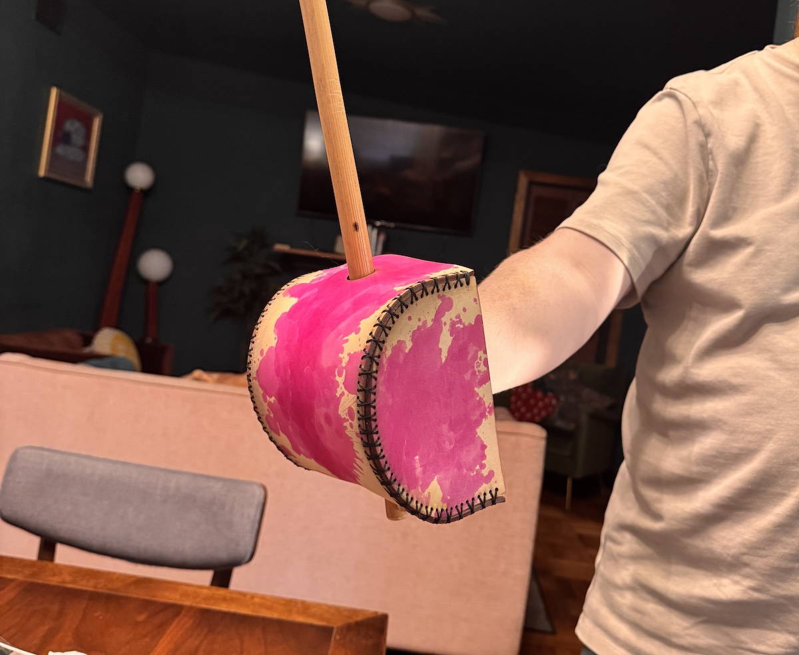

# DIY Singlestick Guard

## Supplies

- **3mm Leather** - I used 3–4mm (around 8oz) leather. Here's the leather I used from Amazon: https://amzn.to/4vyqjjn. Many people like heavier leather (more like 5-6mm).  It's a preference thing.  You can _probably_ get away with something a little lighter, but I really wouldn't go below 3mm.
- **Leather thread/needles** - You'll need some thread and needles appropriate for sewing leather.  Kits on Amazon are like $5-$8 (I used this one: https://amzn.to/4vudUNr).  You're looking for waxed thread and leather/upholstery needles.  You don't really need big, chonky needles but just big enough head to get the thick thread through.  You will appreciate the smallest appropriate needle as you're stitching things, trust me.
- **Dye (optional)** - I like Angelus dyes. They're cheap on Amazon and come in oodles of colors (see all the colors/prices here: https://amzn.to/4oMosEY). Fair warning: they are POTENT. Keep it off anything you care about.
- **Conditioner (semi-optional)** — Conventional wisdom says to condition the piece with something like neatsfoot oil (Amazon: https://amzn.to/4p0R7Gz) after hardening. Not strictly necessary, but it helps keep it from cracking during use.
- **Finisher (optional)** — Folks usually finish leather like this with a beeswax/carnauba wax (the one I got: https://amzn.to/4oO5ii2) or an acrylic sealer (Amazon: https://amzn.to/4gIVNyA). Also not strictly necessary, but it does help reduce wear over time.

## The Pattern

There are a few ways to cut the pattern, and how you do it probably dictates the file you want:

* A high end die cutter (i.e., not a Cricut but like a fancy Siser or something similar) can probably cut it.  If that's your jam, [you want the SVG](guard_pattern.svg).
* A laser cutter.  That's what I used and it works great. In that case, [you again want the SVG](guard_pattern.svg).
* By hand.  It works fine but requires some elbow grease.  I made two printable versions of the pattern: one for [letter sized](guard_pattern_letter_sized.pdf) (i.e., standard 8.5" x 11") paper and one for [legal sized](guard_pattern_legal_sized.pdf) (8.5" x 14") paper.  Print, cut to shape, and awl the holes.

## Process

1. Cut the pattern however works for you: die cutter, laser, by hand, whatever. If you're punching the holes by hand, awl them to about 1-1.5mm.
2. Stitch each side piece to the main straight piece. If you do a simple butt stitch or baseball stitch (look them up on YouTube), you'll need about 10-12 feet of thread each side.  Assembled, it should form a curved D shape with an open back.
3. Dye the leather as desired (you can also do this before you cut if you prefer).
4. Case the leather with water. Rub it down on both sides with a damp rag or sponge.  You want it wet but not saturated, and evenly dark across the surface. If anything got funky during stitching and needs reshaping, wet that area a bit more and reshape it now. As you set the final shape, slide your stick (or a dowel) through both holes.  That keeps the channel straight so the stick will actually pass through once it's hardened. Then let the whole thing dry partway.  That is, it should still be damp when you move on, not totally dry.
5. Now you need to harden it in the oven. While you're doing the previous step, preheat the oven to its lowest setting (usually 170–200°F). Put the basket in while it's still a bit damp. That little bit of moisture helps it harden a touch more than it would dry without cracking or going brittle.
6. Check it every 5 minutes by touching the sides. Depending on your oven, hardening takes anywhere from 15 minutes to an hour. You're after a hardened texture all the way through and all the way around.  Don't just check the edges, since they firm up first. If the edges start looking scorched or thin, pull it immediately, let it cool, and then put it back in the oven for a little while longer being careful to avoid scorching it further.
7.  When it's ready, give the shape and the stick alignment a final check as you pull it. While it's still warm, confirm the D held and slide the stick through both holes.  Warm leather still has a little give, so this is your last easy chance to nudge the channel straight before it sets cold.
8.  Condition while it's warm, straight out of the oven. Oil absorbs into warm leather roughly 10x faster (seriously).  That is, an hour or so versus 8–10 hours cold. To oil it, put a little on a cloth (never straight onto the leather) and rub it on in small circles in a thin coat. Even application is the name of the game: go light, but pay special attention to the edges and stitch holes. Condition both sides (you can go a little lighter on the flesh side than the top grain).
9. Buff and finish. After the oil sits for 1–2 hours, buff it with a clean cloth to lift any excess oil or dye. If a lot of oil comes off, let it cure a while longer. Once it's absorbed, if you plan doing a topcoat/finish, do so per the package instructions.
